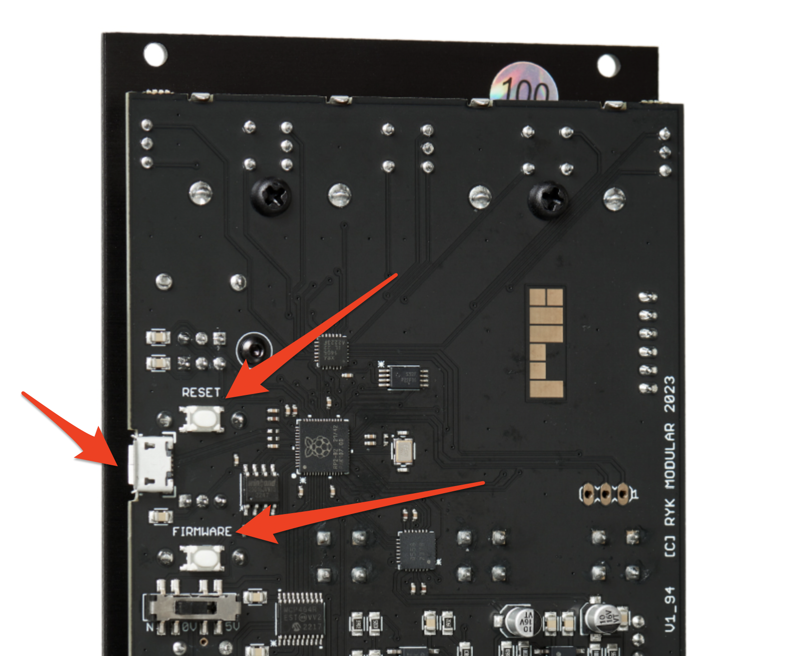
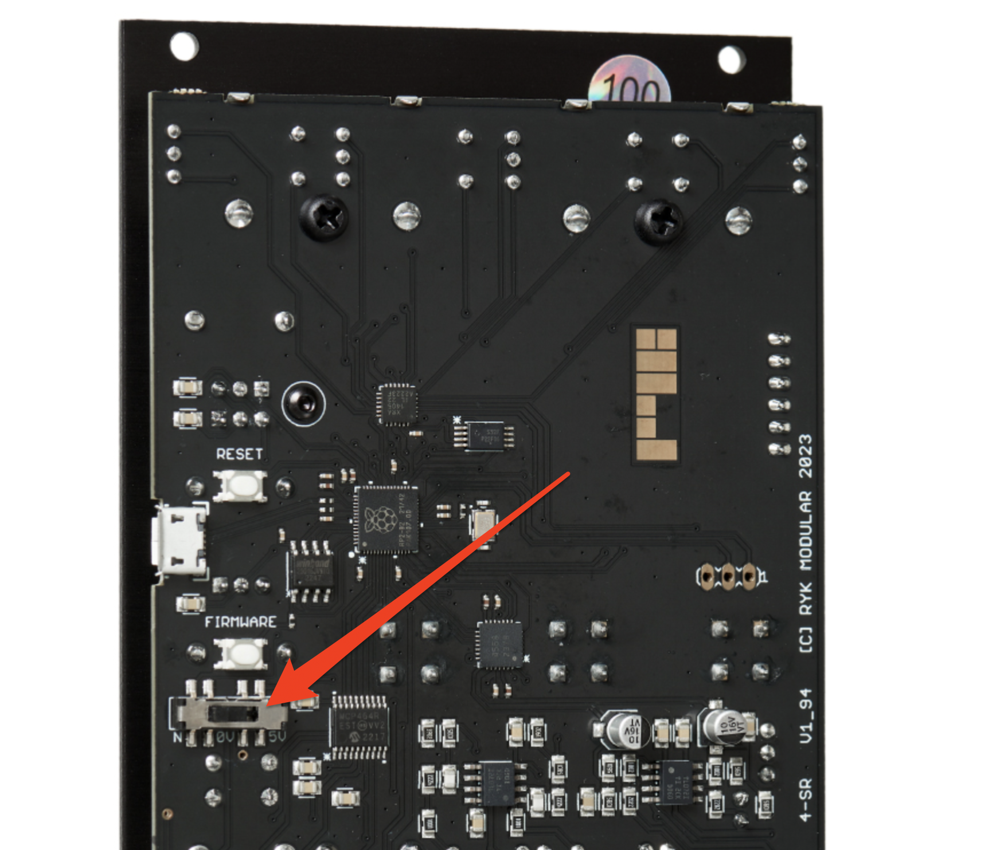
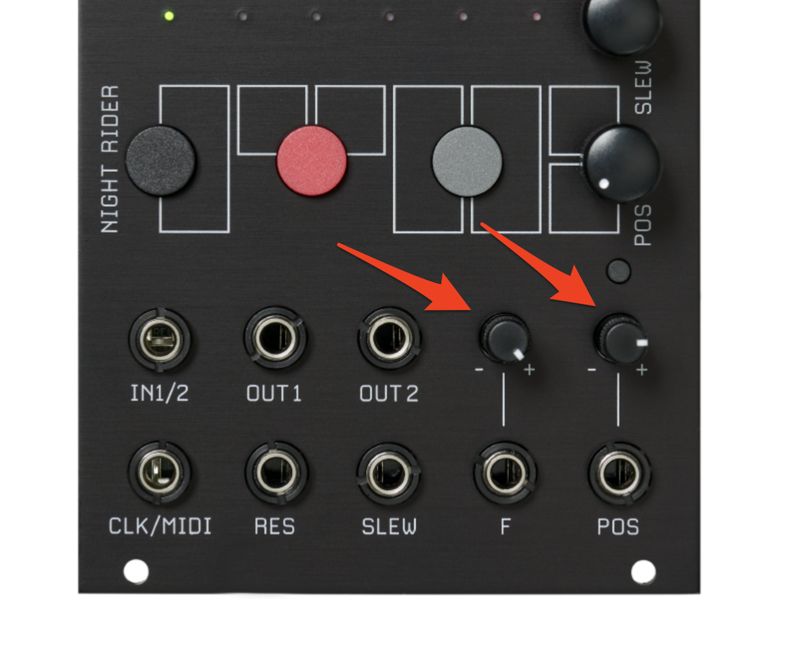
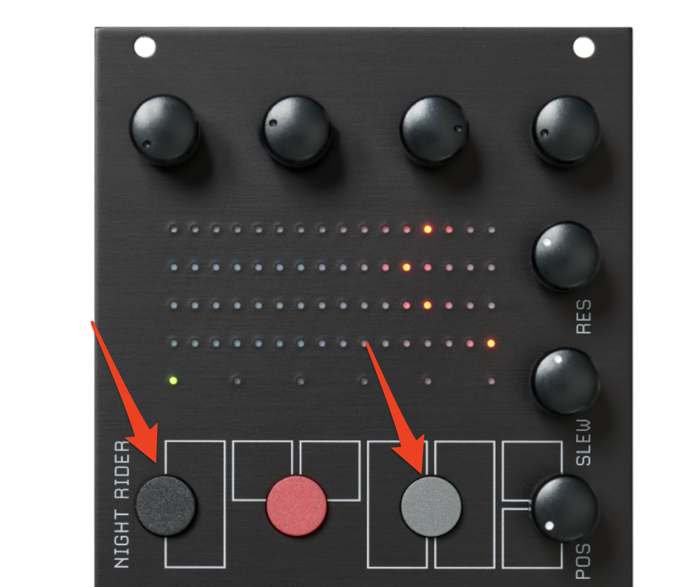

# RYK Modular Night Riderキャリブレーション

## 1. 電源ON

10ピンヘッダをいつも通り指して電源ON

## 2. USBケーブルIN

USBケーブルを指してPCと接続（USBハブは使わないこと）

## 3. ボタン

FIRMWAREボタンを押しっぱにしながら、RESETボタンを一度押し、FIRMWAREボタンを離す。

するとPCでは`RPI-RP2`っていうドライブが見えるようになる。

## 4. firmwareインストール

以下より`Night_Rider_V1.02_DIY_Kit.uf2`ってファイルをダウンロード。

- https://www.ryk-modular.com/kit-construction-documents

ダウンロードしたファイルをさっきの`RPI-RP2`ドライブにドラッグ＆ドロップなりする。するとファームウェアが差し替わり、勝手にejectされる。（Arduinoでよくあるファームウェアアップデート方法）

ここまでのステップがうまく行っていれば、LEDディスプレイに横の線が表示される。

## 5. ADCのキャリブレーション

次はADCらのキャリブレーション。

モジュールを表にしたり裏にしたりするので、そこそこ長い電源ケーブルで、モジュールを裏返しにしてどこかに置くべし。（何かに触れてショートなりしないように注意）

これから以下を使ってキャリブレーションする

便宜上これを「裏スイッチ」って呼ぶ。  
三段階で、左から以下を示す。

- `N`
- `0V`
- `5V`

そしてとりあえずはこれを`N`（左端）にしておく。

それと以下のポテンショメーター2つ。

## 6. 電源ON

以下の黒／グレーボタンを押しながら電源ON

なんかアニメーションして全LEDが光った後、`0V`って表示される。

## 7. 0V

裏スイッチを`0V`に変更し、ポテンショメーターを反時計回りいっぱいに回す（最小値にする）。

ディスプレイに0から5までカウントが表示され、次に`5V`と表示される。

## 8. 5V

裏スイッチを`5V`に変更し、ポテンショメーターを時計回りいっぱいに回す（最大値にする）。

ディスプレイに0から5までカウントが表示され、次に`44`と表示される。

## 9. center

2つのポテンショメーターを真ん中になるように回すとキャリブレーション終了。全部のLEDが光る。

裏スイッチを`N`に戻して完了。