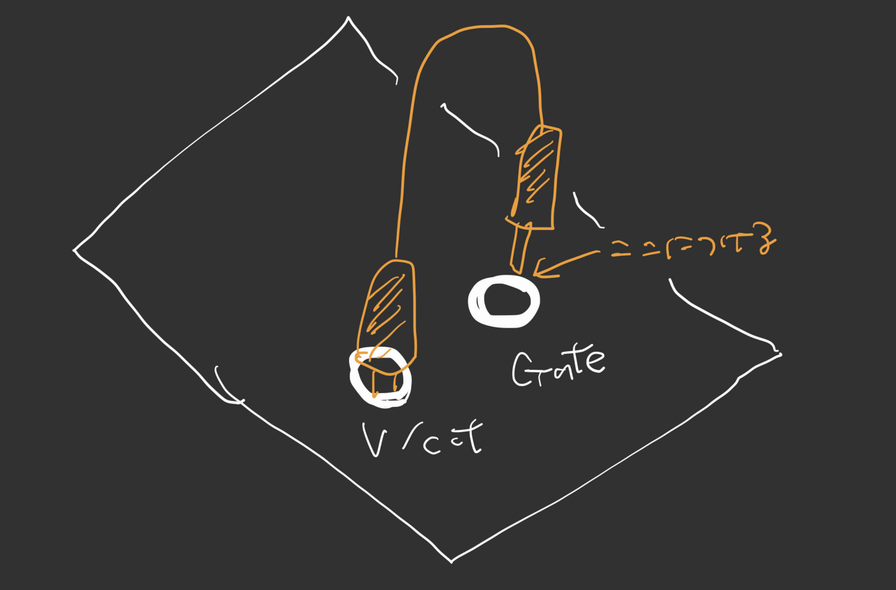
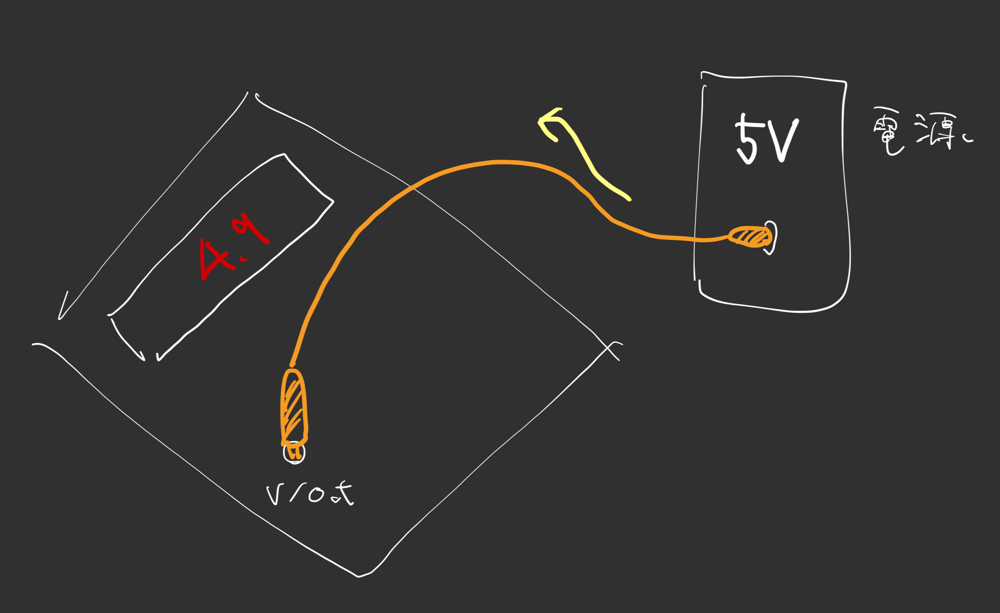

# キャリブレーション

## JOY CAL

左ノブ回してJOY CALにする

- → 右下のノブを押し込んで？キャリブレーション開始
- → joystickぐりぐり回して数値が変わること確認せよ
- → なんか色々数値変わってたらOK

## ADC CAL

左ノブ回してADC CALにする

### 0V

- 片側: V/OCTにイン
- もう片側: 端をGate入力のバレルに触れさせる（Grondに接続するため）

この状態で右下のノブを回し、0Vになるように調節する。  
これを V/Oct，M1、M2、M3、M4の5つについて繰り返す

全てのinputが0Vにキャリブレーションされると、ディスプレイに5Vって出る

### 5V

5V電圧を用意

- 片側: V/OCTにイン
- もう片側: 5V流れてくる電源に接続

5VをV/Octに流してる状態で、右下のノブを押すと、キャリブレーション処理が走るらしい。おそらくこれでこのモジュールが、これが5Vだって言う基準として記憶するという処理になる模様

これを V/Oct，M1、M2、M3、M4の5つについて繰り返す. 
5つ全てのキャリブレーションが完了するとディスプレイにDONEって出る

## P-VOICE

最後にパッチをインストール

- 左ノブ回してP-VOICEにする
- 右下のノブを押すと読み込みが始まる
- 1分ぐらいかかって終わるとDONEって出る

