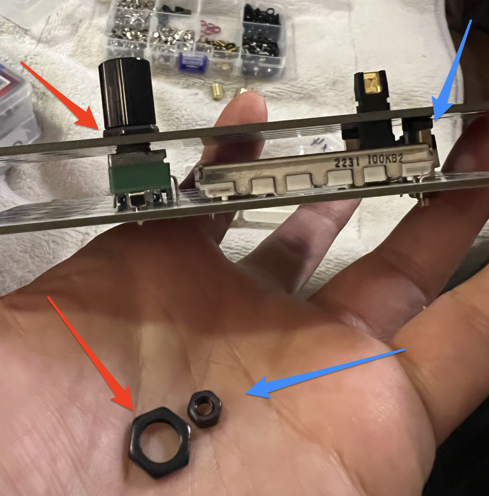

# SHIKENSA関連メモ

## トグルスイッチに交換した場合の注意

トグルボタン → トグルスイッチに交換した場合、トグルスイッチの高さがトグルボタンよりも少し高いので、そのままだとパネルとPCB間の距離を少し広げてしまう。爪部分をうまく折って収まればそれが良さそうだけど、微妙に折れそうで難しそうな感じもしたので、以下のようにスペーサーの上にナットを追加し、パネルとPCBの間隔を広げるほうが良いかも。

横から見た時にPCBとパネルの間の距離が等しくなるように、以下赤枠部分にナットを入れるなりすると良さげ。

## 縦フェーダーのツメ

以下のように右から2番目は折らないとハマラナイので注意。（PCBには右から2番目の穴はない）

## トグルボタンをトグルスイッチに交換の部品

- [トグルスイッチ ON-ON【MS610F】](https://www.marutsu.co.jp/pc/i/56377/)

## チェックリスト（暫定）

- CLOCKへの接続が無い合
  - TEMPOのノブ位置に応じてステップが進む？
  - CLK CVにCVを渡すと、テンポが変化する？
    - CLK CVのノブ位置に応じて入力をattenuateする？
- CLOCKにgateを入れると
  - step毎のフェーダーが順に光る
  - IN/CKから同じclockが出力される？
  - step毎のフェーダーの高さに応じたCVがOUTから出力される？
  - ADDにCVを入れると、OUTの出力がADDの入力と加算される？
  - LEVELノブ位置に応じてLVL OUTからの出力が変化する？（おそらくstep毎のCVをattenuateする？）
    - LVL CVにCVを綿うと、LVL OUTからの出力をattenuateする？
- RESETへgateを入れると
  - stepが1つ目に戻る
- LENGTHのスイッチ操作
  - 3の時: 3ステップ目でループする
  - 4の時: 4ステップ目でループする
  - 5の時: 5ステップ目でループする
- 下部のスイッチをON／OFFスイッチ
  - step毎にLEDが点灯する
  - ONになっているstepの部分だけ、TRIGからgateが出力される？
