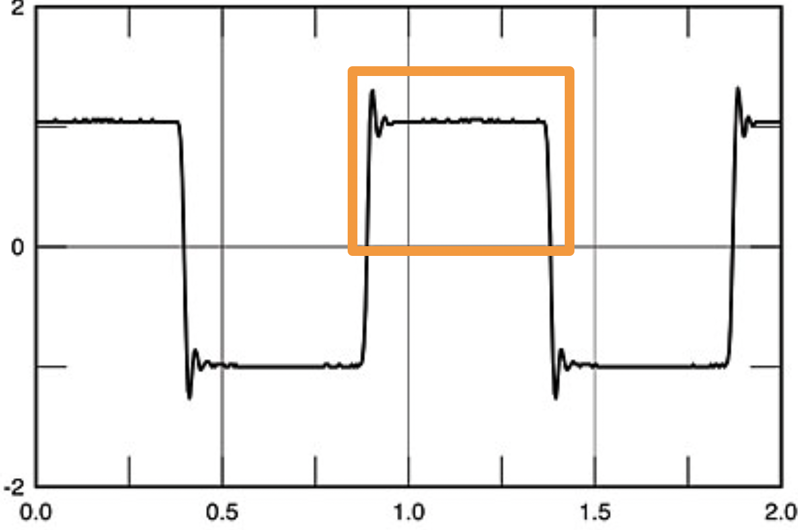

# x0x heartのキャリブレーションに関するメモ

4つtrim potがあって、これらを使ってキャリブレーションする。  
以下がそれ。

- `TM1`: 5.333Vの参照電圧の調整
- `TM4`／`TM5`: VCO CVレスポンス
- `TM3`: VCFのCutoff周波数を調整する

一度設定したらイジる必要はない。他のキャリブレーションの前にまずはこれらを設定すべし。

## TM1: 5.333Vの参照電圧の調整

- これは何: 内部的に参照する電圧を決定するtrim pot。ボリューム上がるとクリップするみたいな処理になるんだけど、その塩梅をいい感じに調整するやつ。これで調整した結果が5.333Vになってるといい感じ（超意訳）

以下、J4-pin1この箇所の電圧をテストできる模様？ おそらくこのJ4-pin1にテスターでも当てながら`TM1`を回し、5.333Vにするように調整するのが、x0x heartオススメのオリジナルに近い設定みたいな模様。

> オリジナルの303では5.333Vの調整が使用され、VCO CVジェネレーターのDAC制御電圧を設定しました。x0x-heartではCVが内部で生成されないため、これは必要ありませんが、5.333Vの供給電圧はx0x-heartの音の響きを決定しますので、お好みに合わせて調整することができます。設定するには、J4のピン1に出力電圧（標準は5.333V）をモニターしながらTM1を回します。
> 
> x0x-heartは、303の電源を再現するためにスイッチング電源と抵抗フィルターを使用しています。そして、オリジナルと同様に、重い負荷がかかると電圧が下がることがあります。TM1を5.333Vに設定すると、電圧が下がるのはたまにしか起こりませんが、それ以上に高くすると発生頻度が増加し、低くするとそれを排除できます。電圧が下がるのは12Vラインでのみ発生し、通常はアクセント付きの音符でのみです。
> 
> 12Vラインから電力を取る追加の回路を設置すると、この現象が起こる可能性が増加します。
> もし電圧の下がりが望ましくない場合は、R4とR3に並列に抵抗をはんだ付けします。47kから100kの値が適しています。抵抗値が低いほど、電圧が下がる可能性は低くなります。レギュレーターに損傷を与える可能性があるため、12k以下の値は使用しないでください。

## TM4／TM5: VCO CVレスポンス

- これは何: 1V/Octで出音が調律されるように調整するtrim pot。これが調整されてないと1V/Octでのピッチ指定どおりに出音が出ないので重要。

まず以下を準備。

- Audio outをNTS-2とかでチューナーにしてモニターする
- TUNEノブ（Tuningのことだと思う多分）を中央に合わせる

そして、1V/Octに、

- 1Vを流す
- 2Vを流す

を交互にしてみる。すると、音が出るはずなんだけど、ここで、2Vを流した時のチューニングが、1Vを流した時のチューニングの1オクターブ上になるように、`TM5`のtrim potを回して調整する。これができたら、とりあえずは1Vで1オクターブの差が出るように出音が調律された状態になる。

ただし、この状態だとまだ、C3とかを送っても、C3じゃなくてD3だとかE3だとかズレた状態になってるはず。これをC3へと合わせる調整をする。それをやるのが`TM4`のtrim pot。1V/Octに2Vを流したら、Audio Outのチューニングが65.4Hz（中央のCの2オクターブ下）になるように`TM4`を回して調整する。

これでチューニングが完了。

調整後の確認として、なんかしらのシーケンサーより、適当に1V/Octを渡しててみて、シーケンサーからC3を送っている時、x0x heartのAudio outのチューニングがC3に、C4を送っている時はC4に、C5を送っている時はC5になるように……という具合になっていなければならない。（この確認方法は大体のアナログオシレーターのチューニングで同じなので検品クリア項目であると認識すること）

端的にまとめると、出音をチューナーにつっこんで、シーケンサーから送った1V/Oct通りのチューニングになるように`TM4`と`TM5`をいじればいい。

> VCO CVの調整は、まずCV幅を調整し、次にオフセットを調整することが最適です。これは通常1V/オクターブに設定されますが、デバイスの限界内であれば他の値に設定することも可能です。TUNEノブを中央位置に設定し、CV入力（J1 - ピン13,14）で1Vと2VのCVを交互に入力し、オシロスコープやギターチューナーで音声出力をモニターします。TM5を調整し、1Vと2Vの信号が正確に1オクターブ離れた音を出すようにします。次に、TM4を回してCVオフセットを調整し、2Vの信号が中央のCよりも2オクターブ低い音（65.4Hz）を出すようにします。これであなたのx0x-heartは調律されるはずです。

## TM3: VCFのCutoff周波数を調整する

- これは何: VCFの効き具合を調整するtrim pot

好みの話っぽいが、とりあえずオリジナルの303に近い状態に調整しておく。  
以下翻訳を参考に調整。書かれているノブの状態にし、オシロスコープでの波形出力の以下の部分（rippleと呼ばれているがたぶんココ）が、約2msになるようにするのがオススメ303調整とのこと。

> VCFカットオフの調整は好みの問題です。エンベロープ変調がスイープする正確な範囲を変更します。303のマニュアルによると、次のように設定することを提案しています：CUTOFFノブを中央に設定し、波形をノコギリ波にし、RES1とRES2のノブを完全に時計回りに、ENVMOD、DECAY、ACCENTのノブを完全に反時計回りにします。VCOに2VのCV（65.4Hz）を適用し、オシロスコープでVCF出力（J8 - ピン1）をモニターします。ノコギリ波の波紋は2ms間隔で配置されるべきです。
> オシロスコープがない場合は、65.4Hzの音の上に500Hzの音が聞こえるかどうかを聞いてください。